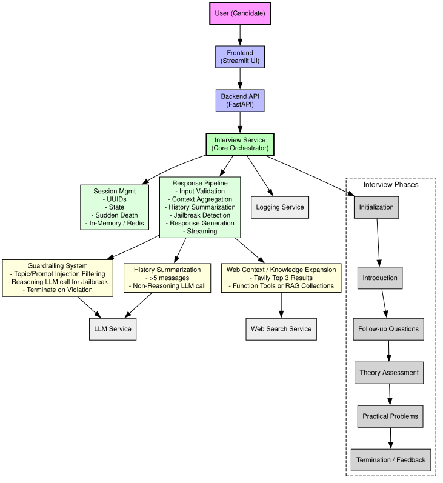

# Excel-lent AI Interview Application – Technical Design Document



## Architecture Overview

- Client-server architecture with clear separation of concerns:
  - **Frontend (Streamlit UI)** – User interface, session management, real-time streaming.
  - **Backend API (FastAPI)** – Endpoints, session orchestration, streaming response handling.
  - **Interview Service** – Core logic orchestrator: session management, guardrails, context handling, and response generation.
  - **Supporting Services**:
    - **LLM Service** – Candidate response evaluation, reasoning, and content filtering.
    - **Web Search Service (Tavily)** – Knowledge enrichment from approved domains.
    - **Logging Service** – Tracks system events, session data, and errors.

---

## Core Components

### 1. Frontend (Streamlit UI)

- Chat-based interface for interviewer-candidate interaction.
- Maintains session state and interview progression.
- Handles real-time streaming of responses.
- Supports interview restart and session initialization.

### 2. Backend API (FastAPI)

- Exposes endpoints:
  - `/interview` – Start a new interview session.
  - `/response` – Handle candidate responses.
- Manages interview sessions using **UUID-based identification**.
- Implements streaming response handling for dynamic interaction.

### 3. Interview Service

- Core orchestrator implementing interview logic, context management, and guardrails.

#### a) Session Management

```python
class InterviewSession:
    def __init__(self, session):
        self.session = session
        self.sudden_death = False
        self.sudden_death_counter = 0
```

- Tracks session state, sudden death conditions, and session-specific variables.
- **Session storage**:
  - Small-scale deployments: stored in-memory.
  - Large-scale deployments: Redis can be used for persistence and horizontal scaling.

#### b) Key Features

1. **History Management**
   - Triggered when session history exceeds 5 messages.
   - Maintains conversation context while reducing token usage.
   - Preserves key candidate skill information.
   - **Non-reasoning LLM call for reasoning**:
     - Uses a lightweight LLM call to summarize history without performing full reasoning.
     - Optimizes cost and latency while retaining essential context for subsequent responses.

2. **Guardrailing**
   - Validates candidate input relevance to interviews.
   - Prevents topic deviation, prompt injection, and malicious attempts.
   - **Reasoning LLM call for jailbreak detection**:
     - LLM evaluates whether candidate input attempts to bypass guardrails.
     - Consequences of jailbreak attempts: system terminates the interview session to maintain integrity.

3. **Web Context / Knowledge Expansion**
   - Executes targeted web searches via **Tavily** for skill-related queries.
   - **Top 3 results** are extracted for relevance to the topic provided by the LLM.
   - Can be implemented using:
     - Function tools to dynamically fetch web context.
     - Self-curated **RAG collections** for pre-indexed knowledge when function calls are unavailable.
   - Enhances interviewer knowledge base and response quality.

4. **Response Generation Pipeline**
   - Multi-step response generation incorporating session history and context.
   - Applies guardrails, validation checks, and context enrichment.
   - Manages interview duration, response streaming, and termination conditions.

---

## Interview Flow

### Phases

1. **Initialization**
   - Candidate enters name.
   - Session created with unique UUID.
   - Welcome message generated and delivered.

2. **Introduction Phase**
   - Ice-breaker questions.
   - Sets expectations and context for the interview.

3. **Follow-up Questions**
   - Expands on candidate’s previous answers.
   - Evaluates depth of understanding.

4. **Theory Assessment**
   - Tests conceptual knowledge of given topic's features and functions.

5. **Practical Problems**
   - Hands-on tasks for applied skill evaluation.
   - Real-time problem solving and candidate guidance.

6. **Termination / Feedback**
   - Interview ends when all phases complete or sudden death / jailbreak conditions are triggered.
   - Feedback delivered based on performance and guardrail compliance.

### Per-Response Processing

- Input validation for relevance and topic adherence.
- Context aggregation from history and web resources.
- History summarization via non-reasoning LLM call.
- Jailbreak detection via reasoning LLM call.
- Response generation through multi-step pipeline.
- Streamed delivery of responses to frontend.

---

## Key Features

### 1. History Management

```python
async def summarise_history(self):
    if len(self.session["history"]) > 5:
        # Summarization logic
```

- Prevents context window overflow.
- Maintains conversation coherence.
- Uses **non-reasoning LLM call** to summarize efficiently.

### 2. Guardrailing System

```python
async def guardrail_input(self, user_input, preface):
    # Content filtering logic
```

- Ensures interview focus on related topics.
- Uses **reasoning LLM call** to detect jailbreak attempts.
- Interview is terminated if malicious or off-topic inputs are detected.

### 3. Web Context Integration

```python
async def get_web_context(self, question):
    # Web search and context extraction
```

- Enhances response quality using **top 3 relevant results from Tavily**.
- Can leverage function tools or self-curated **RAG collections**.
- Maintains domain-restricted, controlled knowledge sources.

---

## System Prompt Guidelines

1. **Interviewer Identity**
   - Professional demeanor, direct and focused questioning.
   - Rigorous skill evaluation and structured feedback.

2. **Phase Management**
   - Structured progression through interview stages.
   - Clear phase objectives and evaluation criteria.

3. **Response Handling**
   - Single-question focus.
   - Complete, coherent answers required.
   - Clear and actionable feedback mechanism.

4. **Interview Control**
   - Early termination for non-compliance, sudden death triggers, or detected jailbreak attempts.
   - Performance-based phase progression.
   - Structured evaluation and feedback delivery.

---

## Technical Considerations

- **Scalability**
  - Session-based architecture allows horizontal scaling.
  - Async request handling supports multiple concurrent users.
  - Streaming response support ensures real-time interaction.

- **Reliability**
  - Comprehensive error handling and fallback mechanisms.
  - Session persistence (in-memory or Redis for large-scale deployments).
  - Timeout management to maintain performance and integrity.

- **Security**
  - Input validation at multiple stages.
  - LLM-based guardrails for off-topic/jailbreak prevention.
  - Domain restrictions for web searches to prevent malicious content.