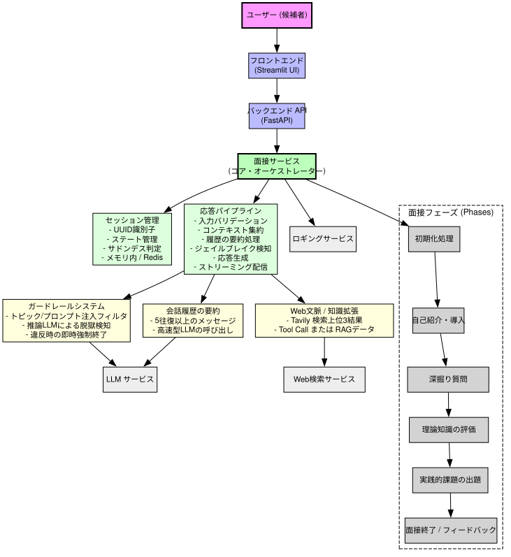

# Excel-lent AI Interview Application - 技術設計書



---

## 技術スタック / アーキテクチャ選定

* **フロントエンド (Streamlit UI)**: チャットインターフェースの提供、セッション状態の管理、およびリアルタイムのレスポンスストリーミングを実装。
* **バックエンド API (FastAPI)**: `/interview` および `/response` エンドポイントの提供、セッション管理およびストリーミングの制御。
* **Interview Service (Core Orchestrator)**: セッション管理、ガードレール機能、コンテキスト処理、およびレスポンス生成の中核ロジックを実装。
* **周辺サービス**:
    * **LLM Service (Qwen3:8B, LMStudioによるローカル実行)**: 候補者の回答評価、推論、およびガードレール制御。
    * **Web Search Service (Tavily)**: コンテキスト拡張のためのトピック関連知識の取得。
    * **Logging Service**: モニタリングおよびデバッグのためのイベント、セッション、エラー情報の記録。

### 制約事項および留意点
* LLMのローカル実行に伴い、レスポンス生成に遅延（レイテンシ）が生じる。
* 現在のモデルサイズ（Qwen3:8B）はローカルリソースの要求が高く、無料のクラウドサービス上にはデプロイできない。
* ハードウェア要件はあるものの、プロジェクトは完全なオープンソース互換であり、全環境をローカルに構築可能。
* **緩和策**:
    * レスポンス高速化のための小規模モデルまたは量子化モデルの採用。
    * スケール化に向けたローカルGPUまたは有料クラウドサービスの活用。非同期処理によるエンドユーザー向けの遅延隠蔽。

---

## システムの動作フロー

### 1. フロントエンド (Streamlit UI)
* ユーザーはチャットインターフェースを介して対話。
* セッション状態および面接フローの保持。レスポンスのリアルタイムストリーミング。
* 面接の再開およびセッション初期化に対応。

### 2. バックエンド API (FastAPI)
* 公開エンドポイント:
    * `/interview`: 新規面接セッションの開始。
    * `/response`: 候補者からの回答の処理。
* UUIDベースのセッション管理。
* フロントエンドへのストリーミングレスポンスの配信。

### 3. Interview Service
* 面接ロジック、コンテキスト、およびガードレール機能を制御するコアオーケストレーター。
* **セッション管理**
    ```python
    class InterviewSession:
        def __init__(self, session):
            self.session = session
            self.sudden_death = False
            self.sudden_death_counter = 0
    ```
* セッション状態、サドンデス、およびその他の変数の追跡。
* **ストレージ**: 小規模構成ではインメモリ、大規模展開時はRedis（オプション）を利用。

---

## 主要機能

* **履歴管理**: トークン消費量を削減するため、Non-Reasoning LLM呼び出しを用いて過去のメッセージを履歴要約。
* **ガードレール機能**: Reasoning LLM呼び出しを用いて、テーマ外の入力や悪意のある入力を検知。ジェイルブレイクの試みを検知した場合は面接終了。
* **ナレッジ拡張**: Tavilyから上位3件の関連検索結果を取得。または、オプションとしてFunction Toolsや独自構築のRAGコレクションを利用。
* **レスポンス生成処理**: コンテキスト、ガードレール、Web知識、および履歴を統合し、多段階のレスポンスを生成。

---

## 面接フロー

1.  **Initialization (初期化)**: 候補者が氏名を入力。セッションが作成され、ウェルカムメッセージを送信。
2.  **Introduction (導入)**: アイスブレイクおよびガイダンスの提示。
3.  **Follow-up Questions (深掘り質問)**: 回答に対する深掘りと詳細な評価。
4.  **Theory Assessment (理論評価)**: 概念的知識の検証。
5.  **Practical Problems (実践課題)**: ハンズオンタスクによる応用スキルの評価。
6.  **Termination / Feedback (面接終了・フィードバック)**: 規定の完了、またはサドンデス／ジェイルブレイク検知に伴う終了処理。評価フィードバックの提示。

### 1レスポンスあたりの処理フロー
* 入力バリデーション
* コンテキスト集約
* 履歴要約 (Non-Reasoning LLM呼び出し)
* ジェイルブレイク検知 (Reasoning LLM呼び出し)
* 多段階レスポンス生成
* フロントエンドへのストリーミング配信

---

## 本システムのゴール

* スキル評価に特化した、制御可能かつ構造化された面接体験の実現。
* コンテキストを考慮したレスポンスによるリアルタイムな対話。
* ガードレール機能による、プロフェッショナルかつ適切な会話の担保。
* ナレッジ拡張による高品質な回答の生成。

---

## 課題と対策

* **レイテンシ**: ローカルLLM (LMStudio上のQwen3:8B) の実行に伴うレスポンス生成の遅延。
    * *対策*: 小規模・量子化モデルの採用、非同期ストリーミングの適用。
* **リソース要件**: モデルサイズに起因し、無料のクラウド環境での実行が不可。
    * *対策*: ローカルGPU環境または有料クラウドインスタンスの活用。
* **スケーラビリティ**: 単一マシンによる同時セッション数の制限。
    * *対策*: Redisによる分散セッション管理の導入、および水平スケール。
* **外部検索依存性**: Tavily連携の失敗または遅延の可能性。
    * *対策*: 独自構築のRAGコレクションへのフォールバック、またはFunction Toolの活用。
* **ユーザー入力への対応**: ガードレール機能による誤検知（正当な入力のブロック）。
    * *対策*: LLMフィルタリングルールの微調整、管理者向けのフィルタ手動オーバーライド機能の提供。

> 本プロジェクトのすべてのコンポーネントは、完全にオープンソース互換であり、プロプライエタリな制限を受けることなく、全機能をローカル環境のみで実行可能である。